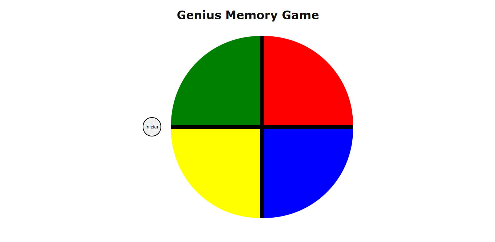

## Genius Memory Game

O genius foi um brinquedo físico que buscava incentivar a memoria de cores e som. Nesse projeto procura-se, usando os conteúdos estudados na Digital Inovation One, reproduzir a mesma experiências na web.  

## Tecnologias 

No geral foi usando HTML para a estrutura, CSS para o estilo e Javascript para a criação do dinamismo esperado. 

## Layout 

## Contribuição

Caso deseje usar o projeto sinta-se livre para edita-lo ou contribuir. 

